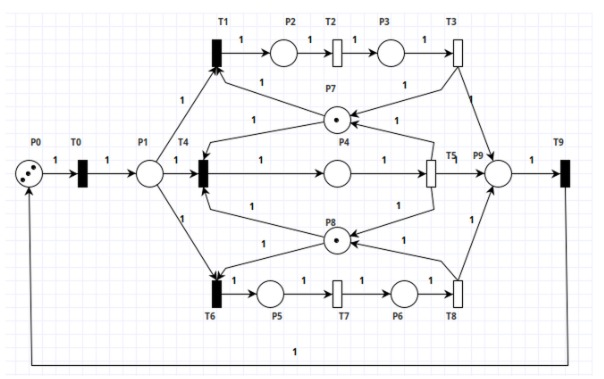
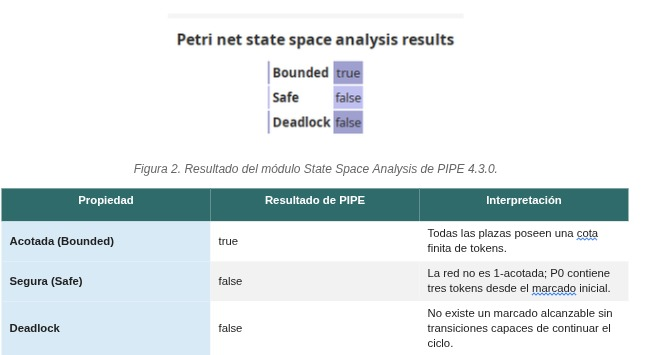
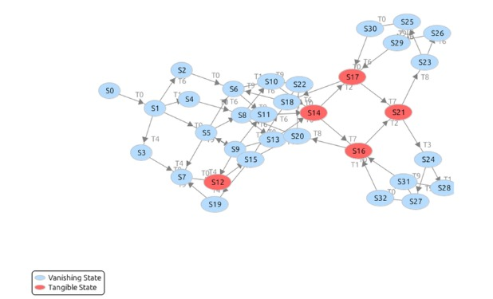

# Validación de la Red de Petri en PIPE

## 1. Objetivo

El objetivo de este documento es registrar la validación de la Red de Petri oficial del sistema de procesamiento de transacciones de pago mediante PIPE 4.3.0.

La validación permite confirmar que la red utilizada por el equipo coincide con el modelo del enunciado y documentar sus principales propiedades antes de utilizarla como base para la implementación en Java.

---

## 2. Red analizada

La Red de Petri analizada posee:

- 10 plazas, identificadas como `P0` a `P9`;
- 10 transiciones, identificadas como `T0` a `T9`;
- tres flujos posibles de procesamiento;
- dos plazas que representan recursos compartidos: `P7` y `P8`;
- una plaza de salida `P9`;
- una plaza de arribo o estado IDLE `P0`.

El marcado inicial utilizado es:

```text
M0 = (3, 0, 0, 0, 0, 0, 0, 1, 1, 0)
```

considerando el orden:

```text
(P0, P1, P2, P3, P4, P5, P6, P7, P8, P9)
```

Los tres tokens de `P0` representan las tres transacciones que circulan por el sistema.

Los tokens unitarios de `P7` y `P8` representan respectivamente:

- disponibilidad del gateway de tarjetas;
- disponibilidad del motor antifraude.

Los tres recorridos posibles son:

```text
Pago con tarjeta:
T0 -> T1 -> T2 -> T3 -> T9

Pago de alto riesgo:
T0 -> T4 -> T5 -> T9

Transferencia bancaria:
T0 -> T6 -> T7 -> T8 -> T9
```

La topología y el marcado inicial analizados en PIPE corresponden a la red oficial utilizada por el proyecto.

---

## 3. Análisis del espacio de estados

Mediante el módulo `State Space Analysis` de PIPE 4.3.0 se obtuvieron las siguientes propiedades:

| Propiedad | Resultado |
|---|---|
| Bounded | `true` |
| Safe | `false` |
| Deadlock | `false` |

---

## 4. Acotación

PIPE informa:

```text
Bounded = true
```

Esto significa que todas las plazas de la red poseen una cantidad finita de tokens para todos los marcados alcanzables.

Por lo tanto, la red es **acotada**.

La cantidad de tokens en las plazas no puede crecer indefinidamente durante la ejecución del modelo.

---

## 5. Seguridad

PIPE informa:

```text
Safe = false
```

Una Red de Petri es segura cuando ninguna plaza puede contener más de un token en cualquiera de sus marcados alcanzables.

En este modelo, `P0` contiene tres tokens desde el marcado inicial:

```text
M(P0) = 3
```

Por este motivo la red no es 1-acotada y PIPE informa `Safe = false`.

Este resultado no representa una falla del sistema ni está relacionado con seguridad informática. Simplemente indica que existe al menos una plaza capaz de contener más de un token.

---

## 6. Deadlock

PIPE informa:

```text
Deadlock = false
```

Esto indica que no existe un marcado alcanzable desde el cual ninguna transición pueda continuar la evolución de la red.

Por lo tanto, para el marcado inicial analizado, la red no presenta estados terminales de deadlock.

---

## 7. Grafo de alcanzabilidad

PIPE generó un grafo compuesto por **33 marcados alcanzables**, identificados desde `S0` hasta `S32`.

Los nodos del grafo representan los distintos marcados alcanzables de la red y los arcos representan los disparos de las transiciones que permiten evolucionar de un marcado hacia otro.

El grafo obtenido no contiene estados terminales de deadlock.

Dentro del análisis se identificaron estados en los cuales existen transiciones temporales capaces de avanzar de forma concurrente.

Entre los casos relevantes se encuentran:

| Estado | Transiciones temporales | Interpretación |
|---|---|---|
| S12 | `T5` | Una operación de alto riesgo ocupa simultáneamente P7 y P8. |
| S14 | `T2` y `T7` | Tarjeta y transferencia avanzan en paralelo. |
| S16 | `T2` y `T8` | Tarjeta y transferencia avanzan en paralelo. |
| S17 | `T3` y `T7` | Tarjeta y transferencia avanzan en paralelo. |
| S21 | `T3` y `T8` | Tarjeta y transferencia avanzan en paralelo. |

---

## 8. Vivacidad

Desde los diferentes marcados alcanzables es posible completar los flujos activos, recuperar los recursos `P7` y `P8`, retornar las transacciones a `P0` y volver a seleccionar cualquiera de los tres caminos disponibles desde `P1`.

Los tres T-invariantes cubren además todas las transiciones de la red:

```text
IT1 = {T0, T1, T2, T3, T9}
IT2 = {T0, T4, T5, T9}
IT3 = {T0, T6, T7, T8, T9}
```

En consecuencia, el modelo conserva la posibilidad de volver a ejecutar sus transiciones y se interpreta como una **red viva**.

---

## 9. Paralelismo observado

El máximo de operaciones temporales de procesamiento simultáneas observado en el análisis es **dos**.

Esto ocurre cuando:

- una transacción utiliza `P7` en el flujo de tarjeta;
- otra transacción utiliza `P8` en el flujo de transferencia.

Ambos flujos pueden progresar simultáneamente porque utilizan recursos compartidos diferentes.

El flujo de alto riesgo requiere simultáneamente `P7` y `P8`, por lo que no puede avanzar mientras dichos recursos estén ocupados por los otros flujos.

---

## 10. Evidencias

Las capturas obtenidas mediante PIPE se almacenarán en:

```text
docs/img/pipe/
```

Se utilizarán las siguientes evidencias:

### Red oficial cargada en PIPE



### Resultado de State Space Analysis



### Grafo de alcanzabilidad



---

## 11. Conclusión

La validación realizada mediante PIPE confirma que el modelo utilizado por el equipo corresponde a la Red de Petri oficial del sistema.

El análisis permite concluir que la red:

- es acotada;
- no es segura en el sentido de 1-acotación;
- no presenta deadlocks alcanzables;
- posee 33 marcados alcanzables;
- conserva la posibilidad de volver a ejecutar todas sus transiciones;
- permite un máximo observado de dos operaciones temporales de procesamiento en paralelo.

Con esta validación queda definida la red formal que utilizarán los demás componentes del proyecto.